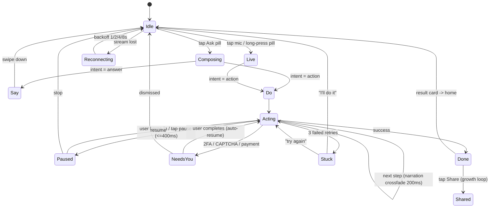

# Strlix — UI Vision

**For:** Ankit
**Date:** 2026-09-21
**Status:** Opinionated draft. Decisions, not options.

---

## TLDR (one screen)

**Strlix is not a chat app. Strlix is a phone that does things for you, and a window to watch it happen.**

1. **North star:** *"I asked, and it just did it — and I could see it."*
2. **The product atom is a completed task, not a message.** No threads, no chat list, no "New chat" button. History = a scrubable **Replay** of things Strlix did.
3. **First body = a cloud phone.** New users get a blank Android phone in 8 seconds with zero permissions and zero personal data on it. They watch it order food. *Then* we ask to come home to their real phone. This single sequencing decision kills the spyware problem.
4. **Desktop is a phone window, period.** `⌘K` opens the Ask bar **inside** the bezel, sliding up over the bottom of the phone screen. Never a right-hand chat panel. Never a cockpit. If it looks like scrcpy or BrowserStack, we've lost.
5. **Ask pill is the only entry point** on both surfaces. 56dp, bottom-anchored, always there. It morphs into the answer; it never navigates to a page.
6. **Two modes, one sheet: Say and Do.** In Do mode the sheet shrinks to 120dp and the phone screen behind it comes alive. The wow is *watching your phone use itself.*
7. **Humane and Rabbit died of:** no app ecosystem, unhidden latency, no screen, and a demo they never shipped. Strlix inherits 3M Android apps, hides latency behind visible motion, *is* a screen, and must ship exactly what it demos.
8. **Ship-blocker metric: Time-To-First-Wow p50 ≤ 45s.** North star metric: **WATU** — weekly users completing ≥3 agent tasks.
9. **Wow-now (8 weeks):** Ask→Do with plain-English narration, Live voice with true barge-in, desktop bezel + ⌘K, Replay log, 12 golden intents at 95% success, shareable replay GIF.
10. **Non-negotiable trust triad:** grant at point-of-need → visible while active → one-tap revoke, forever, in the same place.

---

## 1. North-star emotional promise

> **"Strlix is the friend who takes your phone, does the annoying thing, and hands it back — and you got to watch the whole time."**

Three words that must be true of every pixel: **calm, capable, watchable.**

---

## 2. First 60 seconds

### Android — the cold-start ladder

| t | What happens | Copy |
|---|---|---|
| 0:00 | Open. **No signup. No carousel. No permission dialog.** Black screen, S mark strokes on in 600ms. | — |
| 0:02 | A phone bezel materializes and starts **booting on screen**, with an honest counter. Charming, not a spinner. | "Making you a phone. ~8 seconds." |
| 0:09 | Boot completes into a clean Android home. The Ask pill slides up from below with a spring. One haptic tick. | "This phone is yours. Nothing of yours is on it. Try me." |
| 0:11 | Three chips above the pill, **pre-picked for irresistibility**, not for coverage. | `Order me a coffee` · `Find the cheapest flight to Goa` · `Make me a meme` |
| 0:14 | Tap a chip. Sheet morphs up 260ms, then **immediately collapses to 120dp** as the phone starts moving. | "Opening Chrome…" |
| 0:20–0:45 | Strlix taps, types, scrolls. One line of narration crossfades at the bottom. The user does nothing but watch. | "Searching flights" → "Sorting by price" → "Found ₹4,120 on the 14th" |
| 0:46 | Done. Result card slides over the bottom third. Success haptic. **Share button present.** | "Done. ₹4,120, IndiGo, 6:40am. Want me to book it?" |
| 0:52 | *Only now:* soft account prompt. Dismissible. | "Keep this phone? [Save with Google] · [Later]" |

**Rules:** no account, no permission, no tutorial before the wow. The only thing a new user does in the first 45 seconds is **tap once and watch.** That's TikTok's first-session lesson: reduce the first action to below the threshold of decision.

### Desktop viewer — the cold-start ladder

| t | What happens | Copy |
|---|---|---|
| 0:00 | App opens to a **frameless phone bezel**, 420×860, centered, floating on a dark scrim. No window chrome, no menu bar clutter. | — |
| 0:03 | Screen is dark with a 3px indigo line crawling the top of the bezel. | "Waking your phone · usually 8s" |
| 0:08 | Boot → home. Connection dot goes green. A single hint appears **inside** the phone screen, bottom, and fades after 4s. | "Press ⌘K to ask" |
| 0:12 | `⌘K`. A 392px bar rises from the bottom edge of the *phone screen*, scrim over the top 60%. Caret blinking. Focus ring: 1px `#5B8CFF` around the whole screen. | "Ask Strlix…" |
| 0:20 | Type → Enter. The bar drops to a 40px narration strip. Phone starts moving. **Your cursor is not needed.** | "Opening WhatsApp Web" |
| 0:40 | Done. Result renders *on the phone*, not in a desktop panel. | — |
| 0:50 | One-time discovery nudge on the bezel edge, once, ever. | "Drag a file onto the phone to send it there." |

**The desktop's job is to be a better pair of eyes and a better keyboard — not a second product.** Everything the desktop can do, Android can do. Desktop only adds: hardware keyboard passthrough, drag-and-drop, always-on-top, and a bigger canvas.

---

## 3. Screens & flows

### 3.1 Home + Ask bar

```
┌─────────────────────────────┐
│  S                     ◍    │  ← 20dp S mark, avatar. Nothing else.
│                             │
│                             │
│         (calm space)        │  ← 70% empty. This is the whole point.
│                             │
│  ┌───────────────────────┐  │
│  │ ✓ Cancelled Netflix   │  │  ← ONE card: last thing done. Tap = Replay.
│  │   2h ago · 11 taps  ▸ │  │
│  └───────────────────────┘  │
│                             │
│  ⟨ Order the usual ⟩ ⟨ Unsu…│  ← 3 chips, 32dp, h-scroll. Three. Not twelve.
│  ┌───────────────────────┐  │
│  │ S  Ask Strlix…      🎙 │  │  ← 56dp, r=28, bottom+24dp
│  └───────────────────────┘  │
└─────────────────────────────┘
```

**Ask pill spec**
- 56dp tall, 12dp side margins, radius 28dp, 24dp above nav bar.
- Rest: `#191D26`, 1px `#252A35`. Focus: border `#5B8CFF` 1.5px + outer glow `#5B8CFF` @ 22%, blur 32, 0ms→160ms.
- Left: S mark 24dp, `#5B8CFF` at 90%. Right: mic glyph, 44dp target.
- Input type: **17sp minimum.** It's the hero; never shrink it.
- Placeholder rotates every 4s, 240ms crossfade. **Freezes permanently on first keystroke** and never rotates while the keyboard is up.
- **Long-press pill = Live.** Tap mic = Live. Two roads, one destination.
- Send: pill morphs upward into the Answer sheet — shared element, 260ms, radius 28→24. **It does not navigate.** There is no back stack.

**Answer sheet — Say vs Do**

| | Say | Do |
|---|---|---|
| Sheet height | 88% detent | **collapses to 120dp** |
| Content | Answer text, rich cards, sources | One narration line + Pause/Stop |
| Focus | The sheet | **The phone screen behind it** |
| Exit | Swipe down | Auto-collapse to a result card |

Detents: 40% / 88% / full. Drag-to-dismiss with rubber-band at 0.55 resistance.

**Narration strip (Do mode)** — the most important 40dp in the product.
- Exactly **one line**, 15sp, `#9BA3B4`, 200ms crossfade between states.
- Plain English, present tense, no nouns from the codebase: ✅ "Adding pad thai to the cart" ❌ "Executing tap(0.42, 0.81) on node[12]"
- Update at most every 700ms. Faster than that reads as a log and feels anxious.
- Left: 12dp indigo pulse dot, 1.2s loop. Right: `⏸` and `✕`, 44dp each.

### 3.2 Live voice

```
┌─────────────────────────────┐
│                         ✕   │
│                             │
│                             │
│          ╭───────╮          │
│         (   S    )          │  ← 160dp orb. Indigo→violet volumetric.
│          ╰───────╯          │     Idle: breathe 2.4s, scale 1.00→1.04
│                             │     Listening: warm-white waveform ring
│      "go on, I'm here"      │     Thinking: contract to 120dp + shimmer
│                             │     Speaking: ripple out @ 0.6Hz
│                             │
│    ⌨️        ⏹        🔇    │  ← 48 / 64 / 48 dp. Three targets. Only three.
└─────────────────────────────┘
```

- **Tap to open, stays open.** Never push-to-talk. Push-to-talk is a hardware metaphor and it signals "I don't trust my own VAD."
- **Transcript is OFF by default.** Swipe up reveals it. Scrolling transcript makes it a tool; silence makes it a presence. (Character.ai's retention lesson: presence > affordance.)
- **Acting inside Live:** orb shrinks to 48dp and docks top-left; the phone screen is revealed beneath. **Live never blocks the doing.** Narration is spoken, not printed.
- **Thinking ceiling: 900ms.** If no token by 900ms, it says something — "one sec" / "looking" — at low volume. Dead air is what killed the Pin.
- Latency-hiding trick: the first 300ms of TTS is a generated filler phoneme-matched to the real answer's opening, so barge-in during filler costs nothing.

**Barge-in (spec, not vibes)**
- Full duplex. Mic open during TTS with AEC (`AcousticEchoCanceler` + WebRTC APM, 3-band).
- VAD: 250ms voiced above noise floor +9dB → **duck TTS to −18dB in 80ms**.
- 400ms sustained → **hard cancel**: flush audio queue, abort generation, drop the turn. p95 cancel-to-silence ≤ **120ms**.
- On-device keyword hard-stop: "stop", "wait", "no", "nope", "hang on".
- Visual: Strlix's ring drops to 30% opacity, your waveform takes over, ≤120ms.
- **If it's mid-action on the phone:** finish the current atomic operation (never leave a half-typed field), then freeze within 400ms, show a `Paused` chip, and **say nothing.** Silence is the correct response to being interrupted.

### 3.3 Permission onboarding (a11y / mic / overlay without the spyware vibe)

**Five laws.**
1. **Earn, don't ask.** Zero permissions before the first completed task.
2. **Point-of-need only.** The dialog appears inside the sentence "…to do that, I need X."
3. **Show the blast radius in human words**, with a 2s looping micro-demo, not a paragraph.
4. **Visible while active** — not "while enabled." Active is a different, rarer state.
5. **One-tap off, forever, in the same place.**

**The Accessibility flow — "Bring Strlix home"**

Trigger: user has completed ≥1 task on the cloud phone *and* asks for something on their own device.

```
┌─────────────────────────────┐
│  Strlix can do that on      │  Title 22/28, 600
│  this phone too.            │
│                             │
│  ┌───┐ Reads what's on      │  ← each row: 2s Lottie loop, 40dp
│  │▤ │ screen, so it can     │     showing the actual behaviour
│  └───┘ find the button.     │
│  ┌───┐ Taps and types for   │
│  │☞ │ you — only while      │
│  └───┘ you're watching.     │
│  ┌───┐ Sleeps when you      │
│  │☾ │ close it. No          │
│  └───┘ background snooping. │
│                             │
│  Same switch screen readers │  13/16, #636B7D
│  use. You can turn it off   │
│  in one tap, any time.      │
│                             │
│  [ Show me the switch ]     │  ← 52dp, #5B8CFF
│  [ Not now ]                │
└─────────────────────────────┘
```

Then — **the rehearsal.** This is the trick almost nobody does. Before firing the system intent, show a *replica* of Android's Accessibility screen with the exact row highlighted:

> **"Android's next screen sounds scary. It's supposed to.**
> Find **Strlix Control** → turn it **On** → tap **Allow**.
> Then come straight back. I'll be waiting."

A 3-step dot indicator persists as an overlay *over* the Settings app while they're in there (this is the one legitimate use of overlay pre-grant, via a toast-style guide). On return: **no menu, no confirmation screen** — go straight to executing the thing they originally asked for, within 5 seconds. The grant must feel like it *unlocked* something, immediately.

**Always-on trust surface**
- **Active indicator:** 3px indigo line along the very top edge of the display, rendered only while a11y is *reading or acting* — never while merely enabled. Plus a 28dp floating S dot. Tap the dot → sheet with one giant button: **Stop & turn off**.
- **Replay log (the killer feature):** Home shows "Strlix did 14 things on your phone today ▸". Tap → a scrubbable timeline of every single tap with the screenshot it saw. Swipe to share, tap to undo where undoable.
  Copy: *"Everything Strlix does is recorded here, on your phone. You can watch it all back."*
  This is the strongest anti-spyware artifact we can ship: **total recall, user-owned, always visible.**

**Mic** — asked only on the first tap of Live, never earlier.
> "Live needs your mic. It listens only while the orb is glowing — and the orb is the only way in."

**Overlay** — asked **last**, and framed as a feature, not a permission.
> "Want Strlix on top of everything?" → the floating S bubble (AssistiveTouch model: draggable, edge-snapping, 28dp collapsed / 56dp expanded, auto-fades to 40% opacity after 3s idle).
> **100% optional. The product must be complete without it.** Never gate a task behind overlay.

### 3.4 Desktop bezel viewer

```
 ╭───────────────────────────────────────╮
 │ S  Ankit's Strlix   ●           ─ 📌 ⛶│  ← 28px strip. That is the ENTIRE chrome.
 ├───────────────────────────────────────┤
 │ ╭───────────────────────────────────╮ │  ← bezel pad 14px, r=40 out / 32 in
 │ │ 9:41                    ▮▮▮ 87%  │ │
 │ │                                   │ │
 │ │                                   │ │  ┌─ hover-only rail, 40px,
 │ │        [ LIVE H.264 STREAM ]      │ │  │  fades in 200ms:
 │ │                                   │ │  │   🔊 ⟲ ◀ ● ▦ 📷 ⏺
 │ │                                   │ │  └─ hidden by default
 │ │                                   │ │
 │ │░░░░░░░░░░░░░░░░░░░░░░░░░░░░░░░░░░░│ │  ← scrim on ⌘K
 │ │ ┌───────────────────────────────┐ │ │
 │ │ │ S  book a table for 2 at 8   │ │ │  ← 392px bar INSIDE the screen
 │ │ └───────────────────────────────┘ │ │
 │ ╰───────────────────────────────────╯ │
 ╰───────────────────────────────────────╯
```

- **420×860 content default.** Frameless. Drag anywhere on the bezel. Pin = always-on-top.
- Connection dot: 6px. `#3ED598` healthy · `#FFB24D` degraded (>180ms or <20fps) · `#FF5C6B` lost. Hover = tooltip with real numbers. That's the *only* place numbers appear.
- **Controls live on a hover rail on the right edge**, hidden by default. Back/Home/Recents/Volume/Rotate/Screenshot/Record. **We are not building a toolbar.** scrcpy and BrowserStack put 14 buttons around the phone; that is a tool, and tools don't get a billion users.
- **Keyboard passthrough:** armed when the phone screen has focus; 1px `#5B8CFF` ring around the whole screen says so. `Esc` disarms. `⌘K` always wins over passthrough.
- **Continuity steals:** drag a file from Finder → it flies into the phone as a card and lands in Downloads. Drag a photo out → it copies to the desktop. Clipboard bridges both ways, silently, no UI.
- Stream: H.264, 1080×2340 @30fps baseline, **60fps "Turbo"** toggle, 2.5–6 Mbps adaptive, keyframe every 2s, jitter buffer capped at 60ms (we prefer a dropped frame to a delayed one — **latency beats smoothness in a control surface**).

**Backend discipline (android-api vs desktop-api).** These are separate services and they will drift into two products unless we forbid it. Rule: **one shared `Task` / `Step` / `Event` schema; android-api owns the agent loop; desktop-api is a thin viewer + input + control plane that renders the same events.** Design corollary: **the desktop may not invent a UI concept that Android doesn't have.** The only permitted desktop-only affordances are keyboard, drag-and-drop, always-on-top, and window size. Every feature request that violates this gets built on Android first.

### 3.5 Empty / error / offline

| State | Visual | Copy | Recovery |
|---|---|---|---|
| **First run** | Never empty — a phone is already booting | "Making you a phone. ~8 seconds." | — |
| **No history** | The single-card slot holds a chip instead | "Nothing yet. Ask me something annoying." | 3 chips |
| **Waking** | Boot animation + honest countdown | "Waking your phone · usually 8s" | auto |
| **Reconnecting** | Last keyframe, blur 24px, dim 40%, centered pill + 3px indigo top line | "Reconnecting…" | backoff 1/2/4/8s, cap 8s |
| **Lost >30s** | Same, pill turns amber | "Your phone is still there. We're not." | `[Retry]` `[Details]` |
| **Degraded stream** | Amber dot only. **No modal. No banner.** | hover: "142ms · 24fps" | auto-drops to 720p |
| **Agent stuck** (3 failed retries) | Freeze, narration turns to a question | "I got stuck on the payment screen. Want to take over?" | `[I'll do it]` `[Try again]` `[Not now]` |
| **Needs you** (2FA / CAPTCHA / biometric / payment) | Freeze + push notification + deep link to the exact screen, target field focused, pulsing 2px indigo ring on the thing to touch | "Strlix needs you for 10 seconds — approve the login?" | resumes automatically on success |
| **Refused** (paywalled/illegal/ambiguous) | Sheet, one line, no lecture | "I won't do that one. Want me to try X instead?" | alt suggestion |
| **Offline (Android, own phone)** | Ask pill greys, mic stays live for on-device intents | "No signal. I'll run it the second you're back." | queues the task |

**Error copy law — three parts, always:** *what happened (plain) → what it means for you → one button.* No codes in the body; codes live behind a `Details` disclosure, copyable in one tap. Stripe-docs clarity: name the *exact* screen, the *exact* app, the *exact* field.

**The handoff is a feature, not a failure.** A stuck agent that asks cleanly is more trustworthy than one that guesses. Target: **graceful handoff rate ≥95%** — it either succeeds or asks; it never silently fails.

---

## 4. Visual system

**Principle: the chrome is monochrome and the phone screen is the only colorful thing in the room.** Every app on the cloud phone is already saturated and loud — if our UI competes, the composition dies. We spend our entire color budget on one accent.

**Palette**

| Token | Hex | Use |
|---|---|---|
| `bg/base` | `#0B0D12` | Desktop chrome, Live background |
| `surface/1` | `#12151C` | Sheets |
| `surface/2` | `#191D26` | Ask pill, cards |
| `hairline` | `#252A35` | 1px borders |
| `text/1` | `#EEF1F7` | Primary |
| `text/2` | `#9BA3B4` | Narration, secondary |
| `text/3` | `#636B7D` | Meta |
| **`accent`** | **`#5B8CFF`** | S mark, focus, active line, primary CTA |
| `accent/press` | `#4A78E0` | Pressed |
| `accent/glow` | `#5B8CFF` @22%, blur 32 | Focus halo |
| `live/violet` | `#7C6BFF` | Orb gradient partner |
| `ok` | `#3ED598` | Connection, success |
| `warn` | `#FFB24D` | Degraded |
| `danger` | `#FF5C6B` | Stop / revoke **only** |

**Hard rules:** chrome saturation ≤12% except the accent. **Red is reserved for stop.** Never tint "agent acting" red — acting is indigo, always. One accent; no secondary brand color; no gradients outside the orb and the S mark.

**The S mark.** A single continuous stroke, 2.5px at 24dp, rounded caps, indigo. It is the *cursor of the product*: it sits in the Ask pill, it becomes the Live orb (the orb is the S extruded and softened), it is the floating overlay bubble, it is the loading state (stroke-draws in 600ms, `pathLength` 0→1). **One mark, four jobs, zero other loaders.**

**Type** — Inter Variable (Roboto Flex fallback on Android, SF on macOS). Tabular numerics everywhere a number changes.

| Style | Size/LH | Weight | Tracking |
|---|---|---|---|
| Display | 32/36 | 600 | −0.02em |
| Title | 22/28 | 600 | −0.015em |
| **Ask input** | **17/24** | 400 | −0.006em |
| Body | 15/22 | 400 | −0.006em |
| Narration | 15/20 | 450 | −0.004em |
| Label | 13/16 | 500 | +0.01em |
| Mono | 12/18 | 400 | — (dev drawer only) |

**Density.** 8pt grid, 4pt inside icons. Android min touch target 48dp (44dp only for the mic inside the pill). **Max 3 primary actions per screen.** Max 9 rows in Settings at launch. If a screen needs a scroll to show its actions, the screen is wrong.

**Motion.**

| Motion | Spec |
|---|---|
| Standard spring | stiffness 420, damping 34, mass 1 (~280ms settle) |
| Micro (press, ripple) | 120ms `cubic-bezier(.2,.8,.2,1)` |
| Enter / Exit | 200ms / **160ms** — exits are always faster than entrances |
| Pill → sheet | shared-element morph 260ms, radius 28→24 |
| Narration crossfade | 200ms, no vertical movement |
| Orb breathe | 2.4s loop, scale 1.00→1.04, ease-in-out |
| Hover rail | 200ms in / 120ms out, 40px slide |

**The 400ms law:** no indeterminate spinner may live longer than 400ms. At 400ms we replace it with *words describing what is happening*. Uncertainty is the anxiety; duration isn't.

**Reduce-motion:** all springs → 100ms fade; orb → static ring with 1.6s opacity pulse; boot animation → static frame + counter. Contrast: all text ≥4.5:1 on its surface; `#9BA3B4` on `#12151C` = 6.1:1 ✓.

---

## 5. Interaction & latency

**Budget (p50 / p95) — these are contractual.**

| Event | p50 | p95 |
|---|---|---|
| Tap → visual ack (press state, ripple) | 16ms | **50ms** — *always local, never a round trip* |
| Ask pill tap → keyboard + sheet | 120ms | 200ms |
| Mic tap → listening state + waveform motion | 80ms | 150ms |
| First token (Say) | 500ms | 900ms |
| Speech end → first TTS phoneme | 700ms | 1200ms |
| **Barge-in → silence** | 60ms | **120ms** |
| Agent action → visible on stream | 250ms | 500ms |
| Desktop input → pixel change | 80ms | **140ms** |
| Cloud phone cold boot | 8s | 15s |

**Latency hiding, in priority order:** (1) local optimistic ack at 16ms; (2) narrate within 400ms; (3) *move the phone screen* — visible motion on the stream is inherently satisfying and buys us ~800ms of tolerance that a text cursor never would. This is the single biggest advantage we have over the Pin and the R1.

**Haptics (Android)**

| Moment | Pattern |
|---|---|
| Ask pill press | `EFFECT_TICK` |
| Live opens | light double-tick, 8ms / 40ms gap |
| Agent takes control | **one** `EFFECT_HEAVY_CLICK`, at start only |
| Each agent tap | **none** — instead a 1-frame screen-edge indigo pulse. Haptics per tap = machine gun. |
| Task complete | tick · 60ms · tick-up |
| Needs you | triple `EFFECT_TICK` @ 0/70/140ms, distinct, repeats once after 20s |
| Error | single 30ms buzz. Never long. |

**Sound.** Off by default except Live. **Exactly two earcons:** `live_on` (rising two-note sine, 240ms, −18 LUFS) and `live_off` (falling, 180ms). No task-complete chime by default — opt-in in Settings. Notification fatigue is how assistants get muted, and a muted assistant is a churned one.

**Barge-in UX** — specified in §3.2. The cultural point: **a user who feels free to interrupt believes it is listening.** We will measure barge-in rate as a *health* metric, not a failure metric.

---

## 6. What NOT to build

### Why Humane Pin and Rabbit R1 actually failed

1. **No app ecosystem.** They had to rebuild the world before doing anything useful. Every task started from zero. **Strlix inherits 3M Android apps on day one — this is the entire bet, and we should never build a feature that abandons it.**
2. **Latency they couldn't hide.** 5–10s of dead air with no partial feedback. Voice-only means there is literally nothing to look at while you wait. **Strlix acks in 16ms, narrates by 400ms, and shows a moving screen.**
3. **No screen, or the wrong screen.** Humans want to *verify*. A 2.88" display or a laser palm cannot show a booking confirmation. **Strlix's answer is a screen doing the thing — verifiable, screenshotable, shareable.**
4. **They demoed magic and shipped a fraction.** The gap between the launch video and the device was the story. **Rule: nothing goes in marketing that doesn't run in the build, on a median connection, on the first try.**
5. **No trust surface.** You couldn't see what it had done, or undo it. **Replay + one-tap revoke.**
6. **No daily loop.** Nothing made you pick it up at 9am on day 12. **Strlix needs a morning job: notification triage, the usual order, the recurring task.**
7. **Rabbit's mechanism didn't match its story.** "LAM" was largely scripted automations; when that surfaced, credibility collapsed. **Be boring-honest: "Strlix uses your phone the way you do."** Honesty about mechanism is a moat, not a weakness.

They optimized for the reviewer on day 1. We optimize for the user on day 60.

### The ban list

**Chat-app patterns**
- ❌ Sidebar of conversations. ❌ "New chat" button. ❌ Threads, branches, regenerate. History is a timeline of **things done**.
- ❌ Model picker in main UI. Ever. (At most one consumer-named "Turbo" toggle.)
- ❌ System-prompt / persona editor at launch.
- ❌ Infinite feed inside Strlix.

**Engineer-console patterns**
- ❌ Token counts, latency ms, cost, node graphs, JSON, XML tool-call bubbles in user-facing UI.
- ❌ Expandable "Step 3 of 9" reasoning tree. **One line of plain English.**
- ❌ ADB console, logcat, device specs, session IDs. Dev drawer behind 7 taps on version number.
- ❌ Settings page with 40 toggles. Nine rows, max.

**Desktop-cockpit patterns**
- ❌ Right-hand chat panel next to the phone. The Ask bar is **inside** the phone window.
- ❌ Multi-pane layouts, tabs, device grids, dashboards.
- ❌ scrcpy/BrowserStack toolbars. ❌ Device farm aesthetics. ❌ DeX's "now it's a desktop" identity crisis — Strlix is always a phone.
- ❌ Skeuomorphic chrome buttons, glassmorphic bezels, notch cosplay.

**Growth anti-patterns**
- ❌ Mandatory account before the first wow.
- ❌ Permission wall at launch.
- ❌ 5-slide onboarding carousel.
- ❌ Email verification before the phone boots.
- ❌ Streaks, badges, XP at launch. Character.ai's retention comes from *relationship*, not gamification; bolted-on streaks on a utility read as desperate.
- ❌ An AI orb floating on every screen. **One orb, one place.**

---

## 7. Metrics that prove love

**North star: WATU — Weekly Agentic Task Users.** Users who complete ≥3 agent tasks in a week. Not MAU. Not messages. Not minutes.

| Metric | Target | Why it's the one |
|---|---|---|
| **TTFW — time to first wow** (open → first completed agent action visible) | **p50 ≤45s, p95 ≤90s** | Ship-blocker. Nothing else matters if this slips. |
| First-session task completion | **≥65%** | The TikTok "3 videos" equivalent |
| **D1 / D7 / D30** | **40% / 22% / 14%** | D1 40 is the "we have it" line |
| Tasks per user, week 1 | **≥4** | Habit needs ≥3 |
| Tap-ack latency | **p95 ≤50ms** | Perceived quality is latency |
| Desktop input→pixel | **p95 ≤140ms** | Below this it feels like *your* phone |
| Barge-in cancel | **p95 ≤120ms** | The difference between conversation and playback |
| Task success without takeover (top-20 intents) | **≥72%** | Below 70% people stop trusting |
| **Graceful handoff rate** | **≥95%** | Never silently fail — this protects trust more than raw success |
| Permission grant at point-of-need | **≥70%** | If lower, our copy is scaring people |
| **Revoke within 7 days** | **≤3%** | The trust canary. Page someone if it spikes. |
| **"Creepy/spyware" mentions in store reviews** | **<1.5%** | Weekly manual read. Non-negotiable. |
| Live sessions with ≥1 barge-in | **≥30%** | Healthy — users feel free to interrupt |
| Median Live session | **90–180s** | <30s = broken. >15min = lonely-bot risk, investigate. |
| **Replay share rate** | **≥8% of tasks** | The growth loop lives here |
| Crash-free sessions | ≥99.7% | — |
| Stream freezes >2s per session | ≤0.4 | — |

**Two qualitative gates, run weekly, forever:**
1. **The Mom Test:** a non-technical new user reaches a completed task in under 60s with no help. Video it.
2. **The Creep Test:** after the a11y grant, ask "what do you think Strlix can see?" If the answer is wrong, the copy is wrong.

---

## 8. Roadmap

### Wow-now — weeks 0–8
Everything here exists to make TTFW ≤45s and make one screen-recording go viral.
- Ask pill → **Do mode** with narration strip, Pause/Stop.
- Live voice with **true barge-in** (the 120ms spec).
- Desktop bezel + `⌘K` **inside** the window + keyboard passthrough.
- **Replay log** with per-tap screenshots + one-tap revoke.
- **12 golden intents** hand-tuned to ≥95%: save/download a reel · unsubscribe from a mailing list · cancel a subscription · order the usual food · find a photo by description · book a table · fill a form · set up a recurring reminder · summarize a long thread · compare prices across 3 apps · clear notifications · make a meme.
- **Shareable Replay GIF** (720p, ≤6s, tiny S watermark, bottom-right). This is the growth engine, not a nice-to-have.
- Anonymous first session; account prompt only after the first success.

### Next — months 2–5
- **Bring Strlix home** — full a11y onboarding on the user's own phone, with the rehearsal screen.
- **Needs-you handoff** — push → deep link → pulsing ring on the exact target → auto-resume.
- Scheduled + recurring tasks ("every Sunday, order groceries").
- Notification triage — the 9am job that creates the daily loop.
- Personal memory ("my usual", "my sister", "the good card").
- Continuity: drag-and-drop, clipboard bridge, universal paste.
- Android home-screen **widget** that is just the Ask pill.
- iOS viewer app — your cloud phone in your pocket.
- Multi-app chains (screenshot → edit → send).

### Later — months 6–12
- **Async tasks** + "While you were out" digest — the moment Strlix stops needing to be watched (only ship after trust metrics hold for 3 months).
- Multiple phones / device pills dock.
- On-device small model for intent classification + wake word (kills 200ms and the "always uploading" fear at once).
- `ROLE_ASSISTANT` — Strlix as the default assistant on the user's own phone.
- App-specific deep skills where the a11y tree is unreliable.
- Shared "recipes" — carefully. **We are not building IFTTT.** If it needs a builder canvas, we've lost the plot.

---

## 9. Wireframes

### 9.1 Do mode — the money shot

```
┌───────────────────────────────┐
│ ▁▁▁▁▁▁▁▁▁▁▁▁▁▁▁▁▁▁▁▁▁▁▁▁▁▁▁▁▁ │ ← 3px indigo: agent is ACTIVE
│  ┌─────────────────────────┐  │
│  │  🍜 Thai Basil          │  │
│  │  Pad Thai      ₹340     │  │ ← the real app, unobscured,
│  │  [ Add to cart ]  ◉     │  │   ◉ = 24dp indigo touch-echo
│  │                         │  │       at the tap point, 400ms
│  │  Green Curry   ₹380     │  │
│  └─────────────────────────┘  │
│                               │
│                               │
├───────────────────────────────┤ ← sheet collapsed to 120dp
│ ● Adding Pad Thai to the cart │ ← 15sp #9BA3B4, 200ms crossfade
│                      ⏸    ✕   │ ← 44dp each. Two controls. Done.
└───────────────────────────────┘
```

### 9.2 Needs-you moment (the Dynamic Island steal)

```
┌───────────────────────────────┐
│ ▁▁▁▁▁▁▁▁▁▁▁▁▁▁▁▁▁▁▁▁▁▁▁▁▁▁▁▁▁ │
│    ╭───────────────────╮      │ ← pill drops from top, spring,
│    │ S  10 seconds ↓   │      │   40dp tall, r=20, surface/2
│    ╰───────────────────╯      │
│  ┌─────────────────────────┐  │
│  │   Verify it's you       │  │
│  │                         │  │
│  │  ┌───────────────────┐  │  │
│  │  │ ▌                 │  │  │ ← field pre-focused,
│  │  └───────────────────┘  │  │   2px #5B8CFF ring, 1.4s pulse
│  │   Code sent to ••••41   │  │
│  └─────────────────────────┘  │
├───────────────────────────────┤
│ Type the code — I'll take it  │ ← Strlix resumes automatically
│ from there.                   │   the instant it succeeds
└───────────────────────────────┘
```

### 9.3 Replay log — the anti-spyware artifact

```
┌───────────────────────────────┐
│ ‹  Today                      │
│                               │
│  Strlix did 14 things         │  Display 32
│  on your phone today.         │
│                               │
│  ┌──┐ 14:02  Opened Swiggy    │  ← 44dp thumbnail = the actual
│  │▤ │       tapped "Search"   │     screenshot it saw
│  └──┘                         │
│  ┌──┐ 14:02  Typed "pad thai" │
│  │▤ │                         │
│  └──┘                         │
│  ┌──┐ 14:03  Tapped Add ✓     │
│  │▤ │       [ Undo ]          │  ← undo where undoable
│  └──┘                         │
│  ─────────────────────────    │
│  ⏮  ▶  ⏭   ━━━●━━━━━━━━━      │  ← scrub the whole session
│                               │
│  [ Share ]      [ Turn off ]  │  ← revoke is ALWAYS one tap away
└───────────────────────────────┘
```

### 9.4 Live voice, acting

```
┌───────────────────────────────┐
│ (S)                       ✕   │ ← orb docked 48dp top-left,
│                               │   still breathing
│  ┌─────────────────────────┐  │
│  │   [ phone screen, live ] │  │ ← Live NEVER blocks the doing
│  │                         │  │
│  │                      ◉  │  │
│  └─────────────────────────┘  │
│                               │
│  ░░░░▂▄▆█▆▄▂░░░░              │ ← your voice, warm-white,
│                               │   appears the instant you speak
│    ⌨️        ⏹        🔇      │
└───────────────────────────────┘
```

### 9.5 State machine



---

## 10. Steal / avoid, explicitly

| Source | **Steal** | **Avoid** |
|---|---|---|
| **Pixel / iOS** | Ruthless first-run subtraction; system-native permission honesty | Settings sprawl |
| **Dynamic Island** | Transient state that lives *in* the hardware silhouette; the needs-you pill | Cutesy animations without information |
| **AssistiveTouch** | Draggable edge-snapping bubble that fades to 40% | Making it mandatory |
| **ChatGPT / Claude / Gemini apps** | Voice-mode orb quality; streaming feel | Sidebars, threads, model pickers, regenerate |
| **Character.ai** | Presence over affordance; silence is engagement | Parasocial dark patterns, lonely-loop optimization |
| **Perplexity** | Answer-first, sources tucked away | Becoming a research tool |
| **TikTok** | First action below the decision threshold; wow before signup | Infinite feed |
| **Superhuman** | Sub-100ms everything; keyboard-first on desktop; obsessive polish | Onboarding call, elite pricing vibes |
| **Linear** | One accent on dark; `⌘K`; motion that means something | B2B density |
| **Stripe docs** | Error copy that names the exact thing | Docs-as-UI |
| **scrcpy** | Raw input latency discipline | The entire visual language |
| **BrowserStack** | Nothing | Device grids, toolbars, QA framing |
| **Apple Continuity** | Silent clipboard, drag-and-drop, zero-config magic | — |
| **Samsung DeX** | Nothing | Identity crisis: a phone pretending to be a desktop |
| **Humane / Rabbit** | Their ambition | Everything else (§6) |

---

## The one thing

If we ship only one thing perfectly, ship this: **a new user taps one chip and, 30 seconds later, watches their phone finish a chore by itself — then taps Share.**

Everything in this document exists to protect those 30 seconds.
